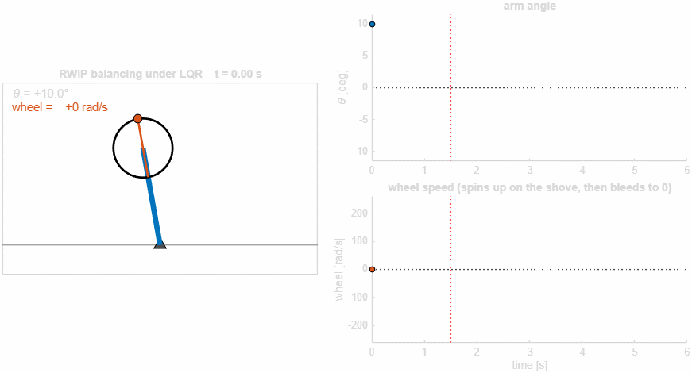
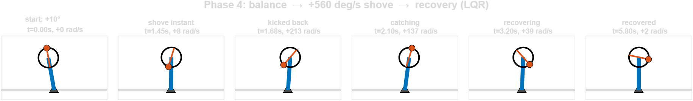
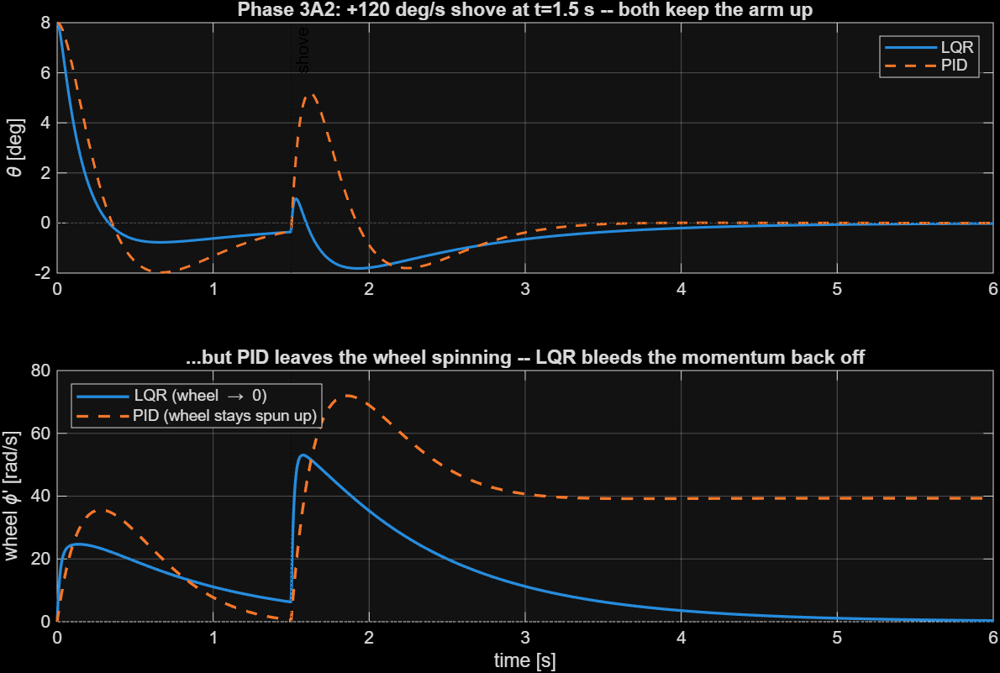
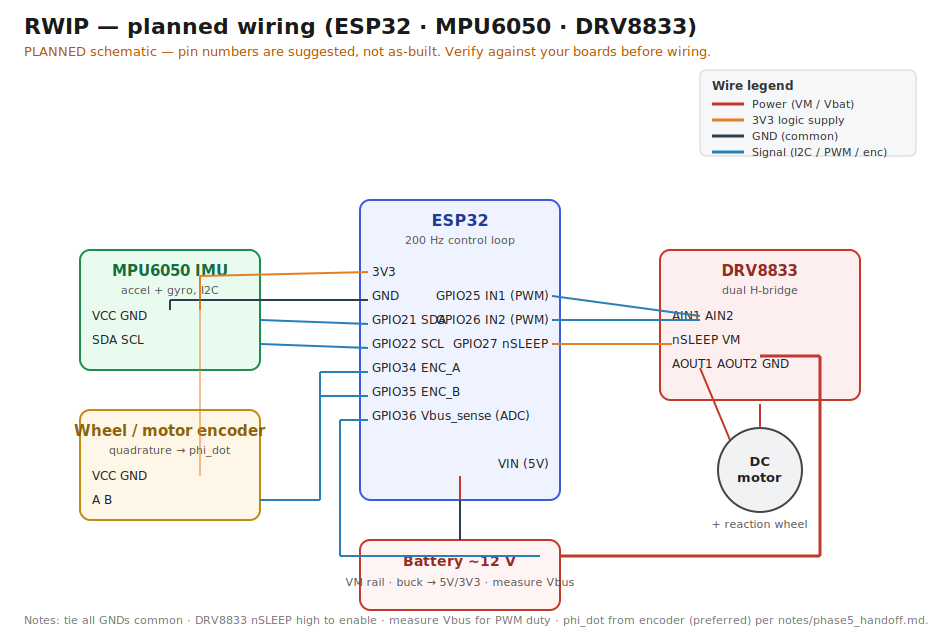

# rwip-balancer

**Reaction-Wheel Inverted Pendulum** — controller design and validation in
MATLAB/Simulink, sim-first, with a planned port to hardware
(ESP32 + MPU6050 + brushed DC motor + DRV8833).

A rigid arm sits on a single pivot bearing with a motor-driven flywheel near the
top. Accelerating the wheel produces an equal-and-opposite **reaction torque** on
the arm, which is used to balance it upright. The interesting subtlety versus a
textbook inverted pendulum is **wheel-speed saturation**: the wheel can spin up
to its limit and lose control authority, so the controller must actively bleed
off wheel momentum. This is the direct analog of magnetorquer saturation in the
CubeSat ADCS detumbling simulator this project extends.

## Demo

Balancing under LQR, then recovering from a +560 °/s impulse "shove" — the wheel
spins up to catch the disturbance, then bleeds its momentum back to zero:





The decisive design point — a naive PID balances the arm but cannot regulate the
wheel, so disturbance momentum accumulates to saturation; LQR with a wheel-speed
penalty bleeds it off:



---

## System & conventions

Two coupled rigid bodies in a plane, rotating about one horizontal axis.
Positive = counter-clockwise (CCW). SI units throughout.

- `θ` — arm angle from **upright**, `θ = 0` is inverted/up (controlled equilibrium).
- `φ̇` — wheel speed **relative to the arm** (what the motor encoder reads).
- State: `x = [θ, θ̇, φ̇]`. The wheel angle `φ` is omitted (cyclic — it does not
  affect the dynamics).
- Motor torque `τ` acts on the wheel; reaction `−τ` acts on the arm.

Full derivation and every sign choice: **[`notes/EOM_derivation.md`](notes/EOM_derivation.md)**.

Equations of motion (frictionless/torque-free form shown; full form in the notes):

```
θ̈ = (mgl·g·sin θ − τ) / I_p
φ̈ = τ / I_w − θ̈
```
with effective coefficients `I_p = I_arm + m_w·l_w²` and `mgl = m_p·l + m_w·l_w`.

---

## Repository layout

```
rwip-balancer/
├── README.md                      this file
├── LICENSE                        MIT
├── .github/workflows/
│   └── matlab-tests.yml           CI: runs the Phase-1 verification on push/PR
├── docs/
│   └── wiring_planned.svg         planned ESP32 / MPU6050 / DRV8833 wiring
├── notes/
│   ├── EOM_derivation.md          Lagrangian derivation + sign conventions
│   ├── phase2_lqr.md              linearization + LQR design notes
│   ├── phase3_robustness.md       PID vs LQR + robustness study
│   ├── phase4_visualization.md    animation + disturbance notes
│   └── phase5_handoff.md          ESP32 implementation spec (gains, HAL, safety)
├── src/
│   ├── rwip_params.m              physical params -> struct (+ derived coeffs)
│   ├── rwip_dynamics.m            nonlinear state derivative for ode45
│   ├── rwip_energy.m              total mechanical energy (verification tool)
│   ├── rwip_linearize.m           linearize about upright -> (A,B,C,D)
│   ├── design_lqr.m               continuous/discrete LQR gain synthesis
│   ├── ctrl_lqr.m                 LQR control law u = -K x
│   ├── ctrl_pid.m                 baseline PID control law
│   ├── rwip_motor.m              brushed-DC motor model (voltage -> torque, sat.)
│   ├── ideal_actuator.m          torque-source actuator (early phases)
│   ├── sensor_imu.m              modeled IMU: gyro bias/noise, accel noise
│   ├── simulate_rwip.m           continuous closed-loop sim
│   ├── simulate_sampled.m        sampled-data (200 Hz ZOH) closed-loop sim
│   └── draw_rwip.m               arm + wheel renderer for the animation
├── scripts/
│   ├── verify_dynamics.m          Phase-1 verification, prints PASS/FAIL
│   ├── phase2_lqr.m               Phase-2 linearization + LQR balance
│   ├── phase3_pid_robust.m        Phase-3 PID vs LQR + robustness
│   ├── phase4_animate.m           Phase-4 animation + disturbance, writes GIF
│   └── phase5_export.m            Phase-5 discretize, validate, export gains
└── results/                       committed plots, GIF, and exported gains
    ├── *.png, phase4_balance.gif  generated figures (see Demo)
    ├── rwip_gains.h               drop-in C header for firmware
    └── rwip_gains.mat             same package for MATLAB reuse
```

> Note: `results/` holds generated artifacts committed for showcase convenience.
> They regenerate from source — delete them and re-run the phase scripts to
> reproduce. For a stricter repo, move them to a release or a `gh-pages` branch.

## Running the Phase-1 verification

From the project root:

```bash
matlab -batch "run('scripts/verify_dynamics.m')"
```

or inside MATLAB:

```matlab
run scripts/verify_dynamics.m
```

It runs three checks on the nonlinear model with `τ = 0` and zero friction, where
the model must reduce to a conservative physical pendulum:

1. **Energy conservation** — total energy `E(t)` stays constant.
2. **Free response = pendulum** — the free wheel's spin angular momentum is
   conserved (it decouples), and `θ(t)` matches an independent single-pendulum
   integration.
3. **Small-angle period** — oscillation period about the hanging equilibrium
   matches `T = 2π·√(I_p / (mgl·g))`.

Each prints a PASS/FAIL with numbers; plots are written to `results/`. The script
exits non-zero (under `-batch`) if any check fails.

---

## Phase roadmap

- **Phase 1 — nonlinear dynamics + verification** ✅ *(this commit)*
  EOM from the Lagrangian; verify energy conservation, pendulum free response,
  and small-angle period vs. analytic.
- **Phase 2 — linearization + LQR balance.** ✅ *done.* Linearized about upright →
  `(A,B,C,D)` (cross-checked vs FD Jacobian), LQR with a wheel-speed penalty,
  brushed-DC motor model with saturation; nonlinear 8° balance settles in 1.23 s
  with the wheel bled back to ~0. See `notes/phase2_lqr.md`. Run:
  `matlab -batch "run('scripts/phase2_lqr.m')"`.
- **Phase 3 — PID comparison + robustness.** ✅ *done.* Sampled-data framework
  (200 Hz, ZOH); baseline PID vs discrete LQR; an impulse "shove" exposes the
  real difference (PID can't regulate wheel speed — momentum accumulates to
  saturation; LQR bleeds it off). LQR confirmed stable under gyro noise+bias,
  accel noise, motor lag, and 10-bit PWM (RMS θ = 0.066°). See
  `notes/phase3_robustness.md`. Run: `matlab -batch "run('scripts/phase3_pid_robust.m')"`.
- **Phase 4 — visualization + disturbance.** ✅ *done.* Animated the arm +
  spinning wheel beside live traces, injected a +560°/s "shove" mid-balance, and
  exported `results/phase4_balance.gif` (+ a 6-pose montage). The wheel spins to
  228 rad/s to catch the shove, then bleeds the momentum back off. See
  `notes/phase4_visualization.md`. Run: `matlab -batch "run('scripts/phase4_animate.m')"`.
- **Phase 5 — handoff.** ✅ *done.* Discretized at 200 Hz, re-validated the gain on
  the realistic chain, and exported `results/rwip_gains.h` (+ `.mat`) plus a full
  ESP32 implementation spec (`notes/phase5_handoff.md`): MPU6050 fusion, sign/unit
  conventions, DRV8833 PWM, safety logic, and control-loop pseudocode. Run:
  `matlab -batch "run('scripts/phase5_export.m')"`.

**All five phases complete** — the sim-first design is fully verified and the
hardware port is packaged. Everything is parameterized off `src/rwip_params.m`:
measure the real rig, drop the numbers in, re-run Phases 2→5, and the gains and
limits regenerate.

---

## What is proven — and what is not

**Proven (in simulation).**
- Nonlinear dynamics verified against physics: energy conservation, free-pendulum
  equivalence, wheel angular-momentum conservation, and small-angle period
  (`scripts/verify_dynamics.m`, PASS/FAIL gated).
- LQR balance from an 8° tilt settles in ~1.23 s with the wheel bled back to ~0.
- LQR vs PID: PID balances the arm but cannot regulate wheel speed; an impulse
  "shove" drives the PID wheel to saturation while LQR bleeds the momentum off.
- Robustness: LQR stable under gyro bias+noise, accel noise, motor lag, and 10-bit
  PWM at 200 Hz (steady RMS θ ≈ 0.066°).
- A validated, discretized gain is exported to `results/rwip_gains.h`/`.mat` — the
  same gain re-validated on the full realistic chain.

**Not proven (yet).**
- **No hardware has been built or tested.** All results above are simulation.
- **No firmware is included.** `notes/phase5_handoff.md` is a spec, not code: pin
  assignments, the I2C/PWM HAL, and the encoder driver are left to the firmware
  build.
- Plant parameters in `src/rwip_params.m` are design estimates, not measured from
  a physical rig. Measure the real rig and re-run Phases 2→5 to regenerate gains.
- The wiring diagram in `docs/` is a **planned** schematic, not an as-built board.

In short: this is a fully verified sim-first control design with a packaged
hardware handoff — not a finished robot.

## Requirements

Developed and tested on **MATLAB R2024a**.

- **Base MATLAB** (`ode45`) — Phase 1 verification only.
- **Control System Toolbox** (`lqr`, `dlqr`, `care`, `ss`, `tf`, `c2d`) — Phases 2+.
- **Symbolic Math Toolbox** — *optional*, only to re-derive the EOM.

No other toolboxes are required. CI runs the Phase-1 verification on every push
(see `.github/workflows/matlab-tests.yml`).

## Planned hardware wiring

The target build is ESP32 + MPU6050 (I²C) + DRV8833 dual H-bridge + brushed DC
motor with a wheel/motor encoder. A **planned** wiring diagram (pins are
suggested, not yet as-built) is in [`docs/wiring_planned.svg`](docs/wiring_planned.svg):



See `notes/phase5_handoff.md` for the full signal chain, sign/unit conventions,
DRV8833 drive, and safety logic.
